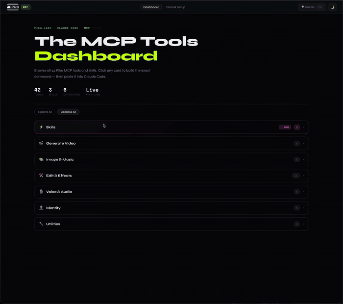

# Pika MCP Dashboard

A community-built reference dashboard for [Pika's MCP](https://pika.me/mcp) — browse all 42 tools, run the 9 skills, and copy the exact Claude Code command to execute them.

🔗 **Live:** [tatinc23.github.io/pika-mcp-dashboard](https://tatinc23.github.io/pika-mcp-dashboard)

---



---

## What it does

- **42 MCP tools** organized by category — Generate Video, Image & Music, Edit & Effects, Voice & Audio, Identity, Utilities
- **9 skill builders** — Podcast, Explainer, UGC Ads, Baseball Trend, Kiss Cam, App Sizzle, App Store Screens, Build a Brand, Founder Product Video — fill in inputs and get the exact `/pika:skill` command
- **Docs & Setup tab** — step-by-step install for both Claude app and terminal, MCP URL + Skills plugin
- Search (⌘K), category filter, dark/light mode

## Setup Pika MCP

**Claude app:** Settings → Connectors → Add → `https://mcp.pika.me/api/mcp`

**Terminal:**
```bash
claude mcp add pika --transport http https://mcp.pika.me/api/mcp
```

**Skills plugin** (Claude app): Customize → Personal plugins → Add marketplace → `Pika-Labs/Pika-Plugins` → Toggle ON

**Skills plugin** (terminal):
```
/plugin marketplace add https://github.com/Pika-Labs/Pika-Plugins
/plugin install pika@pika-plugins
```

## Adding new tools or skills

Open `index.html` and find the `TOOLS` array at the top of the `<script>` block.

**New tool:**
```js
{
  id: 'tool_your_tool',
  badge: 'tool',
  category: 'Generation',
  name: 'Your Tool Name',
  cmd: 'pika__your_tool_name',
  desc: 'One-line description.',
  params: [
    { name: 'prompt', label: 'Prompt', type: 'textarea', req: true }
  ]
}
```

**New skill:**
```js
{
  id: 'skill_your_skill',
  badge: 'skill',
  cmd: '/pika:your-skill',
  name: 'Your Skill Name',
  desc: 'Short card description.',
  explainer: '<strong>What Pika handles automatically.</strong> Describe the hardcoded workflow.',
  params: [
    { name: 'input', label: 'Topic or URL', type: 'textarea', req: true }
  ],
  optionalParams: [
    { name: 'aspect_ratio', label: 'Aspect Ratio', type: 'select', options: ['16:9','9:16','1:1'] }
  ],
  attachNote: 'Drag images into your Claude terminal, or paste a hosted URL above.',
  cmdFn: function(a) {
    return '/pika:your-skill input="' + a.input + '"';
  }
}
```

Commit and push — GitHub Pages deploys automatically.

## Local dev

```bash
python3 -m http.server 8080
# Open http://localhost:8080
```

---

Built by [TAT Inc](https://tatinc.us) · Not affiliated with Pika Labs
